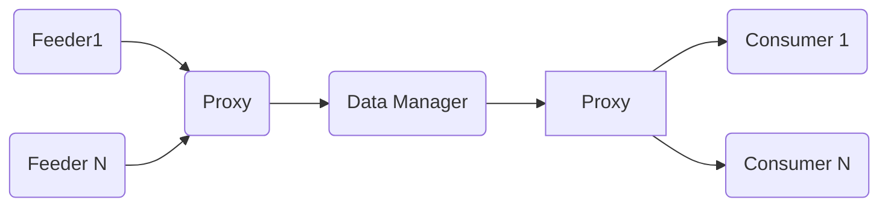
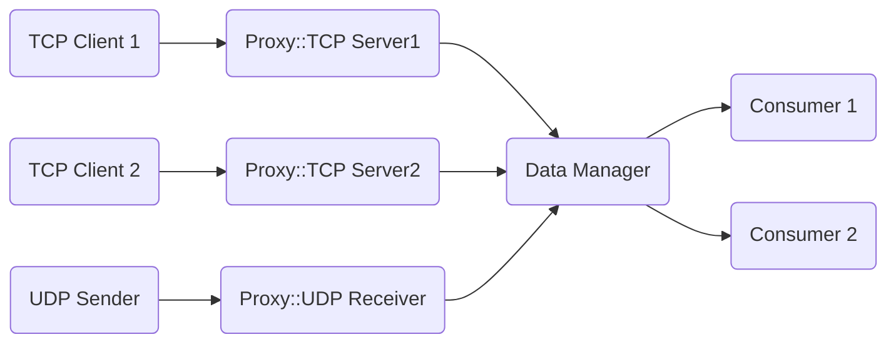

# Introduction
The goal of this project is to propose a multi-feeder multi-consumer C++ data management framework.



## Architecture

### Proxy
There are 2 Proxys, one interfacing the feeders and the other interfacing the consumers.
Each Proxy can instantiate N nodes havine therefore N node receiving data from N feeders.
The output Proxy can instantiate M nodes and each node will be interfaced with a consumer.
The following Proxy node types are supported:
* TCPServer
* UDP
* Local file (TBD)
* Other process (TBD)

### Data Manager

The data manager buffers and routes the data from the feeders to the consumers. There are 2 modes:

* Broadcast mode : every data fed at the input is broadcast to all the consumers
* Map: a route is defined between the consumers and the feeders


# Usage

## Build
```
mkdir build && cd build
cmake ..
make
```
## Topology file

Once the library built, you will need to specify your pipeline's topology through a .json file and pass it to the DataFramework constructor.
```
{
  "dataManager" : {
    "name" : "dm",
    "threadCount" : 8,
    "mode" : "broadcast"
  },
  "inProxy" : [{
          "type" : "TCP_Server",
          "port" : "60000",
          "name" : "TcpServer1"
      },
      {
          "type" : "TCP_Server",
          "port" : "60001",
          "name" : "TcpServer2"
      },
      {
          "type" : "UDP_Rx",
          "port" : "60002",
          "name" : "UdpReceiver"
      }
  ],
  "outProxy" : [{
          "type" : "CONSUMER",
          "port" : "0",
          "name" : "Consumer1"
      },
      {
          "type" : "CONSUMER",
          "port" : "1",
          "name" : "Consumer2"
      }
  ]
}
```

For the example above, we can imagine having the following result, where all data received by the TcpServer1 and 2 is broadcasted to Consumer1 and Consumer2


